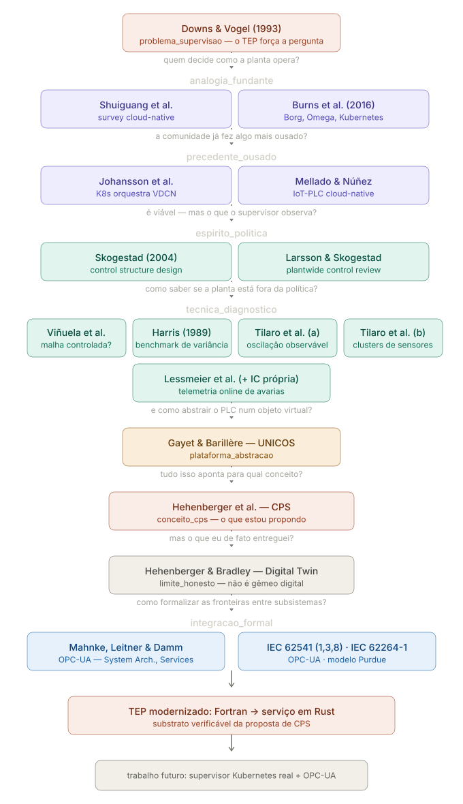

# Monografia TEP — Protocolo de Notas e Referências

## Big Picture

<a href="https://batchuka.github.io/tep-monografia/">
  
</a>

> Clique na imagem para abrir a versão interativa — cada card navega para a nota correspondente.

---


## Inventário de Referências

### Artigos

| Título                                                                                     | Autores                                                              | Ano  | Periódico / Conferência                                 |
| ------------------------------------------------------------------------------------------ | -------------------------------------------------------------------- | ---- | ------------------------------------------------------- |
| A plant-wide industrial process control problem                                            | Downs, J.J.; Vogel, E.F.                                             | 1993 | Computers & Chemical Engineering, v.17, n.3             |
| An expert knowledge based methodology for online detection of signal oscillations          | Tilaro, F.; Bradu, B.; Gonzalez-Berges, M.; Roshchin, M.             | 2017 | CIVEMSA 2017                                            |
| Assessment of control loop performance                                                     | Harris, T.J.                                                         | 1989 | The Canadian Journal of Chemical Engineering, v.67, n.5 |
| Automatic PID performance monitoring applied to LHC cryogenics                             | Bradu, B.; Blanco Viñuela, E.; Marti, R.; Tilaro, F.                 | 2018 | ICALEPCS 2017 (proc. 2018)                              |
| Borg, Omega, and Kubernetes                                                                | Burns, B.; Grant, B.; Oppenheimer, D.; Brewer, E.; Wilkes, J.        | 2016 | ACM Queue, v.14                                         |
| Cloud-Native Computing: A Survey from the Perspective of Services                          | Deng, S. et al.                                                      | 2023 | arXiv:2306.14402                                        |
| Condition monitoring of bearing damage in electromechanical drive systems                  | Lessmeier, C.; Kimotho, J.K.; Zimmer, D.; Sextro, W.                 | 2016 | PHME 2016                                               |
| Control structure design for complete chemical plants                                      | Skogestad, S.                                                        | 2004 | Computers & Chemical Engineering, v.28, n.1             |
| Design of an IoT-PLC: A containerized programmable logical controller for the Industry 4.0 | Mellado, J.; Núñez, F.                                               | 2022 | Journal of Industrial Information Integration, v.25     |
| Kubernetes orchestration of high availability distributed control systems                  | Johansson, B.; Rågberger, M.; Nolte, T.; Papadopoulos, A.V.          | 2022 | IEEE ICIT 2022                                          |
| Model learning algorithms for anomaly detection in CERN control systems                    | Tilaro, F.; Bradu, B.; Gonzalez-Berges, M.; Varela, F.; Roshchin, M. | 2018 | ICALEPCS 2017 (proc. 2018)                              |
| Plantwide control — a review and a new design procedure                                    | Larsson, T.; Skogestad, S.                                           | 2000 | Modeling, Identification and Control, v.21              |
| UNICOS — a framework to build industry-like control systems                                | Gayet; Barillère                                                     | —    | CERN internal                                           |

### Normas

| Norma       | Título                                                                 | Organização          | Edição         |
| ----------- | ---------------------------------------------------------------------- | -------------------- | -------------- |
| IEC 62541-1 | OPC Unified Architecture — Part 1: Overview and concepts               | IEC / OPC Foundation | 2025           |
| IEC 62541-3 | OPC Unified Architecture — Part 3: Address space model                 | IEC / OPC Foundation | 2025 (ed. 4.0) |
| IEC 62541-8 | OPC Unified Architecture — Part 8: Data access                         | IEC / OPC Foundation | 2025 (ed. 4.0) |
| IEC 62264-1 | Enterprise-Control System Integration — Part 1: Models and terminology | IEC                  | 2013 (ed. 2.0) |

### Livros / Capítulos

| Título                               | Autores                    | Ano  | Livro / Editora                                              |
| ------------------------------------ | -------------------------- | ---- | ------------------------------------------------------------ |
| Digital Twin — The Simulation Aspect | Boschert, S.; Rosen, R.    | 2016 | Mechatronic Futures (Hehenberger & Bradley, Eds.) — Springer |
| \[capítulo CPS\]                     | Hehenberger et al.         | 2016 | Mechatronic Futures (Hehenberger & Bradley, Eds.) — Springer |
| Introduction                         | Mahnke, W.; Leitner, S.-H. | 2009 | OPC Unified Architecture — Springer                          |
| Services                             | Mahnke, W.; Leitner, S.-H. | 2009 | OPC Unified Architecture — Springer                          |
| System Architecture                  | Mahnke, W.; Leitner, S.-H. | 2009 | OPC Unified Architecture — Springer                          |

**Resumo:** 13 artigos + 4 normas + 5 capítulos = **22 notas de fonte**

---

## Estrutura do referencial (`referencial/`)

```
referencial/
├── articles/           # PDFs de artigos vinculados via Annotator
├── bibTex/             # arquivos .bib de cada fonte
├── books/              # PDFs de livros
├── notes/
│   ├── .obsidian/      # vault Obsidian (plugins, graph, temas)
│   └── ft_*.md         # notas de fonte
├── standard/           # PDFs de normas
└── big_picture_tcc_tep.svg
```

O vault do Obsidian está em `referencial/notes/`. Abra essa pasta no Obsidian, não a raiz do repositório.

---

## O campo `tags` — papel de cada fonte no argumento

Cada nota de fonte (`ft_`) carrega no frontmatter um campo `tags` que indica **onde aquela fonte se encaixa no argumento da monografia**. Os valores são tags nativas do Obsidian — aparecem no painel de tags e colorem os nós no Graph View.

| Tag                    | Papel no argumento                                                            |
| ---------------------- | ----------------------------------------------------------------------------- |
| `problema_supervisao`  | Ponto de partida — o TEP obriga a perguntar como controlar uma planta inteira |
| `analogia_fundante`    | Cloud-native resolve o mesmo problema de orquestração em escala               |
| `precedente_ousado`    | Trabalhos que já usaram Kubernetes / containers em contexto industrial real   |
| `espirito_politica`    | Teoria de como estruturar decisões de controle numa planta completa           |
| `tecnica_diagnostico`  | Como detectar que a planta saiu da política — o olho do supervisor            |
| `plataforma_abstracao` | Frameworks que abstraem ativos físicos em objetos de software (ex: UNICOS)    |
| `conceito_cps`         | Fundamento conceitual do Cyber-Physical System — o que estou propondo         |
| `limite_honesto`       | O que de fato foi entregue, sem exagerar o alcance (≠ gêmeo digital)          |
| `integracao_formal`    | Normas e protocolos que formalizam as interfaces entre subsistemas            |

**Exemplo de frontmatter:**

```yaml
---
annotation-target: articles/art1_...pdf
titulo: A plant-wide industrial process control problem
autor: Downs, J.J.; Vogel, E.F.
ano: 1993
fonte: Computers & Chemical Engineering, v.17, n.3
tags: problema_supervisao
---
```

---

## Graph View — Grupos por Tag

Configure em **Settings → Graph view → Groups** com filtros no formato `tag:#<valor>`:

| Grupo                  | Filtro no Obsidian          | Cor sugerida |
| ---------------------- | --------------------------- | ------------ |
| `problema_supervisao`  | `tag:#problema_supervisao`  | Vermelho     |
| `analogia_fundante`    | `tag:#analogia_fundante`    | Roxo         |
| `precedente_ousado`    | `tag:#precedente_ousado`    | Roxo claro   |
| `espirito_politica`    | `tag:#espirito_politica`    | Verde        |
| `tecnica_diagnostico`  | `tag:#tecnica_diagnostico`  | Verde claro  |
| `plataforma_abstracao` | `tag:#plataforma_abstracao` | Laranja      |
| `conceito_cps`         | `tag:#conceito_cps`         | Vermelho     |
| `limite_honesto`       | `tag:#limite_honesto`       | Cinza        |
| `integracao_formal`    | `tag:#integracao_formal`    | Azul         |

---

## Protocolo de Tags de Insight

Dentro das notas de fonte, highlights individuais podem receber tags **no corpo da nota** no formato `TIPO-TEMA-POLARIDADE`. Essas tags vinculam fragmentos de conhecimento entre artigos diferentes — dois highlights de fontes distintas com a mesma tag formam uma aresta no grafo.

> Diferença importante: o campo `tags` no frontmatter classifica a **fonte como um todo**. As tags de insight no corpo classificam **fragmentos específicos**.

### Tipo

| Tipo        | Quando usar                                               |
| ----------- | --------------------------------------------------------- |
| `TRADEOFF`  | Melhorar X implica piorar Y — tensão entre dois objetivos |
| `LIMITE`    | Teto ou piso teórico que nenhuma solução consegue superar |
| `PARADOXO`  | Resultado contraria a intuição                            |
| `REQUISITO` | Condição necessária para outra coisa funcionar            |
| `MECANISMO` | Explica *por que* algo acontece — a causa, não o efeito   |
| `METRICA`   | Define uma forma de medir, avaliar ou comparar algo       |

### Tema

| Tema                    | Quando usar                                                           |
| ----------------------- | --------------------------------------------------------------------- |
| `CONTROLE_AUTOMATICO`   | Malhas PID, sintonia, resposta a distúrbios, estabilidade             |
| `SISTEMAS_DINAMICOS`    | Modelagem matemática, equações diferenciais, análise de comportamento |
| `SUPERVISAO`            | Camada acima dos loops — decisão, coordenação, metacontrole           |
| `DIAGNOSTICO`           | Detecção de falhas, sensores ruins, malhas degradadas                 |
| `INSTRUMENTACAO`        | Sensores, atuadores, condicionamento de sinal                         |
| `INTEGRACAO_INDUSTRIAL` | Interoperabilidade entre componentes de controle                      |
| `COMUNICACAO`           | Protocolos, latência, gRPC, OPC-UA, troca de dados                    |
| `MODELAGEM`             | Gêmeo digital, simulação, representação matemática da planta          |
| `CALCULO_NUMERICO`      | Métodos numéricos, precisão e estabilidade                            |
| `SOFTWARE`              | Arquitetura, frameworks, tooling                                      |
| `BENCHMARKING`          | Índices de desempenho, limites teóricos, comparação entre soluções    |

### Polaridade

| Polaridade | Quando usar                                           |
| ---------- | ----------------------------------------------------- |
| `POSITIVO` | Reforça ou justifica uma decisão do projeto           |
| `NEGATIVO` | Contradiz, limita ou critica uma decisão do projeto   |
| `NEUTRO`   | Relevante mas sem posição clara em relação ao projeto |

**Formato final:** `TIPO-TEMA-POLARIDADE` — ex: `TRADEOFF-CONTROLE_AUTOMATICO-NEGATIVO`

---

## Os Quatro Tipos de Nota

### 1. Nota de Fonte (`ft_`)

**Quando usar:** Sempre que estiver lendo um artigo, livro ou seção de norma. Vincula o PDF via Annotator.

**Convenção de nome:** `ft_<titulo-resumido>.md`

**Frontmatter obrigatório:**

```yaml
---
annotation-target: articles/<arquivo>.pdf
titulo: <título completo>
autor: <autores>
ano: <ano>
fonte: <periódico / editora / norma>
tags: <valor da tag>
---
```

---

### 2. Nota Atômica de Conceito (`nt_`)

**Quando usar:** Quando aprende um conceito novo — uma ideia, um método, uma definição. Uma nota por conceito.

**Convenção de nome:** `nt_<conceito>.md`

**Protocolo de escrita:**
1. `conceito` — nome do conceito em uma ou duas palavras
2. `origem` — nota `ft_` de onde veio (ex: `[[ft_Assessment-of-Control-Loop-Performance]]`)
3. `conecta-com` — outros conceitos relacionados, mesmo sem saber como ainda
4. `## O que é` — apenas uma frase direta
5. `## Como se conecta ao projeto` — onde isso aparece no TCC

---

### 3. Documentação do Projeto (`doc_`)

**Quando usar:** Para registrar decisões de arquitetura, descrições de componentes, resultados de experimentos.

**Convenção de nome:** `doc_<componente>_<assunto>.md`

**Protocolo de escrita:**
1. Preencha o frontmatter (componente, relates-to)
2. Seja objetivo — este é um registro técnico, não um diário
3. Sempre termine com `## Próximos passos` ou `## Problemas em aberto`

---

### 4. Brainstorming (`bs_`)

**Quando usar:** Quando uma ideia surge e você não sabe ainda onde ela se encaixa.

**Convenção de nome:** `bs_<tema>_<data>.md`

**Protocolo de escrita:**
1. Escreva sem filtro em `## Ideia bruta`
2. Depois tente responder: "Isso vai para qual capítulo da monografia?"
3. Se souber, linke o capítulo correspondente; se não, deixe `status: incubando`

---

## Infraestrutura Obsidian

Para instruções sobre setup de plugins, como usar o Annotator, e convenções do Obsidian, ver: **[`docs/doc_obsidian_setup.md`](docs/doc_obsidian_setup.md)**
