# Monografia TEP — Protocolo de Notas e Referências

## Big Picture

---

## Inventário de Referências

### Artigos

| Título                                                                            | Autores                                                     | Ano  |
| --------------------------------------------------------------------------------- | ----------------------------------------------------------- | ---- |
| A plant-wide industrial process control problem                                   | Downs, J.J.; Vogel, E.F.                                    | 1993 |
| An Expert Knowledge Based Methodology for Online Detection of Signal Oscillations | Tilaro, F.; Bradu, B.; Berges, A.; Roshchin, M.             | —    |
| Assessment of control loop performance                                            | Burns, W.L.                                                 | 2016 |
| Automatic Assessment of PID Controllers Applied to the LHC Cryogenic System       | Blanco Viñuela; Fernández Adiego; Gayet; Goddet             | 2013 |
| Borg, Omega, and Kubernetes                                                       | Verma, A. et al. (Google)                                   | 2015 |
| Control structure design for complete chemical plants                             | Skogestad, S.                                               | —    |
| Model Learning Algorithms for Anomaly Detection in CERN Control Systems           | Tilaro, F.; Bradu, B.; Berges, A.; Varela, C.; Roshchin, M. | —    |
| Plantwide control — A review and a new design procedure                           | Larsson; Skogestad                                          | —    |
| UNICOS — A Framework to Build Industry-Like Control Systems                       | Gayet; Barillere                                            | —    |

### Normas / Standards

| Título                                                               | Organização                                                      | Versão    |
| -------------------------------------------------------------------- | ---------------------------------------------------------------- | --------- |
| Batch process control — Part 1: Models and Terminology (IEC 61512-1) | International Electrotechnical Commission (IEC)                  | 2015      |
| Batch control (ISA-88 / S88) (IEC 61512)                             | International Electrotechnical Commission (IEC)                  | 1997–2017 |
| OPC Unified Architecture (OPC UA) (IEC 62541)                        | International Electrotechnical Commission (IEC) / OPC Foundation | 2009–2026 |

### Livros

| Título                                                                                    | Autores                                               | Ano  | Editora  |
| ----------------------------------------------------------------------------------------- | ----------------------------------------------------- | ---- | -------- |
| Mechatronic Futures: Challenges and Solutions for Mechatronic Systems and their Designers | Peter Hehenberger, David Bradley (Editors)            | 2016 | Springer |
| OPC Unified Architecture                                                                  | Wolfgang Mahnke, Stefan-Helmut Leitner, Matthias Damm | 2009 | Springer |

**Resumo**: 9 artigos + 3 normas + 2 livros = **14 fontes no total**

---

## Protocolo de Tags — Classificação de Insights

Toda nota de fonte (`ft_`) que contém highlights deve conter tags no formato **TIPO-TEMA-POLARIDADE** para classificar insights importantes.

### Tipo da Tag

| Tipo      | Quando usar                                                                |
| --------- | -------------------------------------------------------------------------- |
| TRADEOFF  | Quando melhorar X implica piorar Y — há tensão entre dois objetivos        |
| LIMITE    | Quando existe um teto ou piso teórico que nenhuma solução consegue superar |
| PARADOXO  | Quando o resultado contraria a intuição — o esperado não acontece          |
| REQUISITO | Quando algo é condição necessária para outra coisa funcionar               |
| MECANISMO | Quando o insight explica *por que* algo acontece — a causa, não o efeito   |
| METRICA   | Quando o insight define uma forma de medir, avaliar ou comparar algo       |

### Tema da Tag

| Tema                  | Quando usar                                                              |
| --------------------- | ------------------------------------------------------------------------ |
| CONTROLE_AUTOMATICO   | Malhas PID, sintonia, resposta a distúrbios, estabilidade                |
| SISTEMAS_DINAMICOS    | Modelagem matemática, equações diferenciais, análise de comportamento    |
| SUPERVISAO            | Camada acima dos loops — decisão, coordenação, metacontrole              |
| DIAGNOSTICO           | Detecção de falhas, sensores ruins, malhas degradadas                    |
| INSTRUMENTACAO        | Sensores, atuadores, condicionamento de sinal, leitura de dados          |
| INTEGRACAO_INDUSTRIAL | Integração de sistemas de controle, interoperabilidade entre componentes |
| COMUNICACAO           | Protocolos, latência, gRPC, OPC-UA, troca de dados                       |
| MODELAGEM             | Gêmeo digital, simulação, representação matemática da planta             |
| CALCULO_NUMERICO      | Métodos numéricos, soluções iterativas, precisão e estabilidade          |
| SOFTWARE              | Padrões de código, arquitetura, implementação, frameworks, tooling       |
| BENCHMARKING          | Índices de desempenho, limites teóricos, comparação entre soluções       |

### Polaridade da Tag

| Polaridade | Quando usar                                                           |
| ---------- | --------------------------------------------------------------------- |
| POSITIVO   | O insight reforça ou justifica uma decisão do seu projeto             |
| NEGATIVO   | O insight contradiz, limita ou critica uma decisão do seu projeto     |
| NEUTRO     | O insight é relevante mas não tem posição clara em relação ao projeto |

### Regras de Construção

- **Tipo fechado** — se não encaixa, o insight não é atômico. Quebre em dois.
- **Tema semi-aberto** — novo tema só com justificativa registrada aqui no README.
- **Código final**: `TIPO-TEMA-POLARIDADE` → ex: `TRADEOFF-CONTROLE_AUTOMATICO-NEGATIVO`

---

## Os Quatro Tipos de Nota

### 1. Nota de Fonte (`ft_`)
**Quando usar:** Sempre que estiver lendo ou for ler um artigo, livro, seção de norma ou qualquer conteúdo externo. Vincula o PDF via Annotator.

**Como invocar o template:**
`Ctrl+P → Templater: Create new note from template → ft.md`

**Convenção de nome do arquivo:** `ft_<autor>_<ano>.md`
Exemplo: `ft_downs_1993.md`

---

### 2. Nota Atômica de Conceito (`nt_`)
**Quando usar:** Quando você aprende um conceito novo — uma ideia, um método, uma definição. Uma nota por conceito. É isso que alimenta o Graph View (`Ctrl+G`).

**Como invocar o template:**
`Ctrl+P → Templater: Create new note from template → nt.md`

**Convenção de nome do arquivo:** `nt_<conceito>.md`
Exemplo: `nt_harris-index.md`, `nt_predictability-index.md`, `nt_controle-discreto.md`

**Protocolo de escrita:**
1. Preencha `conceito` com o nome do conceito em uma ou duas palavras
2. Preencha `origem` com a nota `ft_` de onde veio (ex: `[[ft_harris_1989]]`)
3. Preencha `conecta-com` com outros conceitos relacionados — mesmo sem saber ainda como
4. Escreva em `## O que é` apenas uma frase direta
5. Escreva em `## Como se conecta ao projeto` onde isso aparece no TCC

---

### 3. Documentação do Projeto (`doc-projeto`)
**Quando usar:** Para registrar decisões de arquitetura, descrições de componentes, resultados de experimentos, problemas resolvidos.

**Como invocar o template:**
`Ctrl+P → Templater: Create new note from template → doc.md`

**Convenção de nome do arquivo:** `doc_<componente>_<assunto>.md`
Exemplo: `doc_tep-plant_controllerbank.md`

**Protocolo de escrita:**
1. Preencha o frontmatter (componente, status, relates-to)
2. Seja objetivo — este é um registro técnico, não um diário
3. Sempre termine com `## Próximos passos` ou `## Problemas em aberto`
4. Se virar brainstorming, crie uma nota separada e linke

---

### 4. Brainstorming (`brainstorming`)
**Quando usar:** Quando uma ideia surge e você não sabe ainda onde ela se encaixa. Para conexões entre conceitos. Para perguntas em aberto.

**Como invocar o template:**
`Ctrl+P → Templater: Create new note from template → br.md`

**Convenção de nome do arquivo:** `bs_<tema>_<data>.md`
Exemplo: `bs_opcua_supervisor_20260606.md`

**Protocolo de escrita:**
1. Escreva sem filtro em `## Ideia bruta`
2. Depois tente responder: "Isso vai para qual capítulo da monografia?"
3. Se souber, linke o canvas da monografia e o capítulo correspondente
4. Se não souber ainda, deixe em `status: incubando`

---

## Infraestrutura Obsidian

Para instruções sobre setup de plugins, como usar o Annotator, e convenções do Obsidian, ver: **[`docs/doc_obsidian_setup.md`](docs/doc_obsidian_setup.md)**
